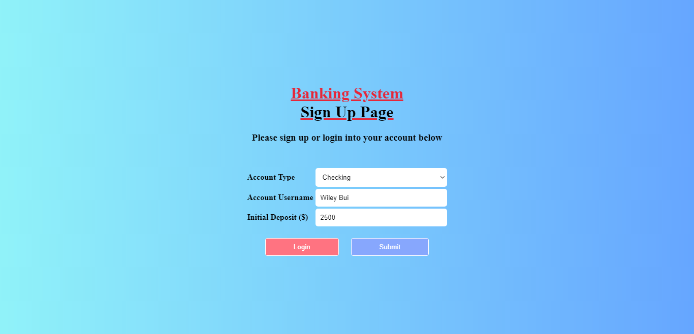
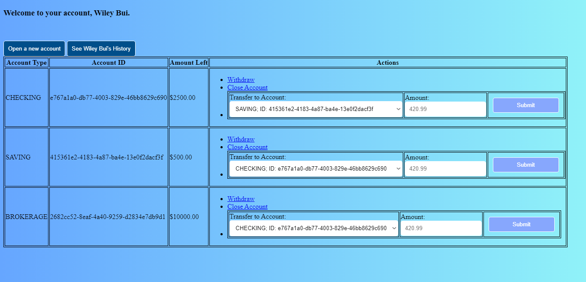

## Banking System - Java Servlet

<a href="https://tomcat.apache.org" target="_blank">Java Apache Tomcat</a> is one of the web servers that allows the capabilities of the servers that host applications in a request-response programming model by responding to a particular type of network request, commonly through a HTTP request.

To understand more about web servers and how they interact with the client side, <a href="https://augusteggers.com" target="_blank">August Eggers</a> and I demonstrate our understanding of how the web server works; we build an online banking application to connect to the online Java Servlet component with authentication and web components. Servlets let us have a dynamic container for the web, and they are the easiest way to maintain sessions through the use of cookies!

## Features
- Identify the user on the server and create a state through sessions/cookies
- Allow users to add multiple different types of accounts into their banking profile: saving, checking, and brokerage
- Allow users to deposit, withdraw, and transfer funds between accounts
- Allow users to remove their accounts only if there is no fund left
- Display the transaction history of the accounts




## Contribution
- Writing Java objects to be used for online banking applications
  - Adding banking users and with its unique ID
    - Ability to add and remove accounts
    - Ability to login to your servlet to identify the user to the server and create state through sessions/cookies
    - Ability to view account transaction history
    - Ability to deposit, withdraw, transfer, and view account balances
  - Storing Java objects to look up their corresponding banking accounts
- Receiving & computing requests and giving their corresponding responses back to the client
- Writing an online servlet component with authentication and web components
- Designing all HTML pages with addition to CSS and sending correct META tags back to the client

## Usage
To compile the every Java Banking System file, go to the `webapps/banking/WEB-INF/classes` folder and type in:
```
javac -classpath ../../../../lib/servlet-api.jar *.java
```

To start up or shut down the server, go to the `bin` folder and type in `./startup.sh` or `./shutdown.sh`
